#**Vehicle Detection Project**

The goals of this project are the following:

* Perform a Histogram of Oriented Gradients (HOG) feature extraction on a labeled training set of images and train a classifier Linear SVM classifier
* Optionally, apply a color transform and append binned color features, as well as histograms of color, to the HOG feature vector.
* Implement a sliding-window technique and use your trained classifier to search for vehicles in images.
* Run your pipeline on a video stream on both test_video.mp4 and project_video.mp4 and create a heat map of recurring detections frame by frame to reject outliers and follow detected vehicles.
* Estimate a bounding box for vehicles detected.

##Histogram of Oriented Gradients (HOG)

###1. Explain how (and identify where in your code) you extracted HOG features from the training images.

The code for this step is contained in the module **vehicle_detection.extractors.HOGTransformer**

For each input image:

1. First it's augmented through histogram equalization on its brightness channel component:
```python
# Convert color space and extract component for shape representation:
image_enhanced = self._get_enhanced(
    image,
    self.color_space
)
```
2. Then HOG description is extracted for each of its three channel component.

```python
# Extract HOG description:
features = []
for image_channel in cv2.split(image_enhanced):
    features.append(
        hog(
            image_channel,
            orientations = self.orientations,
            pixels_per_cell = self.pixels_per_cell,
            cells_per_block = self.cells_per_block,
            transform_sqrt = self.transform_sqrt,
            block_norm = self.block_norm,
            visualise = False
        )
    )

return np.concatenate(tuple(features))
```

The implementation is a sub-class of sklearn Transformer.
I choose this implementation to ease later hyper params tuning since it can be easily
ingested into sklearn's Pipeline and the classification pipeline can be tuned together
as a single model using GridSearchCV.  

I started by reading in all the `vehicle` and `non-vehicle` images.  Here is an example of one of each of the `vehicle` and `non-vehicle` classes:

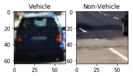

The following two augmentations are used to improve training set data quality:

1. All the images are flipped horizontally;
2. Histogram equalization has been applied to the lightness channel component of each image.

The first augmentation aims to enlarge the size of training dataset.
The second is used to improve the quality of HOG description.

After that, HOG description for all three channel components are extracted.

Here is an example using the `YUV` color space and HOG parameters of `orientations=9`, `pixels_per_cell=(8, 8)` and `cells_per_block=(2, 2)`:

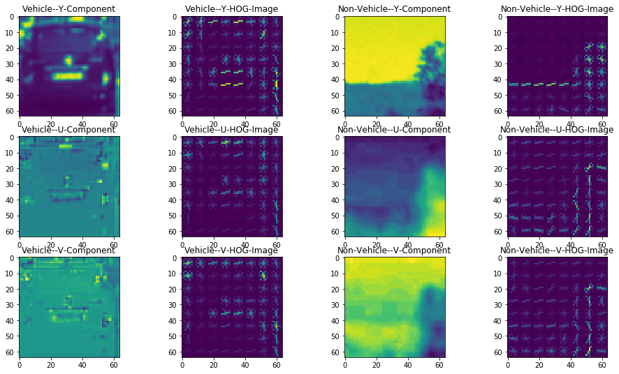

###2. Explain how you settled on your final choice of HOG parameters.

The final HOG params are written in **conf/vehicles.json** as follows:

```json
{
  "hog_color_space": "YUV",
  "hog_shape_only": false,
  "hog_orientations": 9,
  "hog_window_size": [64, 64],
  "hog_pixels_per_cell": [8, 8],
  "hog_cells_per_block": [2, 2],
  "hog_normalize": true,
  "hog_block_norm": "L2-Hys",  
}
```

The choice was made based on the 5-fold cross validation:

```python
# Create cross-validation sets from the training data
cv_sets = StratifiedShuffleSplit(
    n_splits = 5,
    test_size = 0.20,
    random_state = 42
).split(X_train, y_train)

# Model 1: Linear SVC
(model, params) = get_linear_svc()
# Model 2: XGBoost:
#(model, params) = get_xgboost()
# Model 3: Logistic
#(model, params) = get_logistic()

# Make an scorer object
scorer = make_scorer(accuracy_score)

# Perform grid search on the classifier using 'scorer' as the scoring method
grid_searcher = GridSearchCV(
    estimator = model,
    param_grid = params,
    scoring = scorer,
    cv = cv_sets,
    n_jobs = 1,
    verbose = 10
)
```

Here is the explanation for my final params choice:

1. "YUV" color space should be prefered. It is homogeneous, thus L2-norm and
the inner product operation used in linear model have a clear meaning
as distance between colors;
2. At the very beginning only HOG description from lightness channel was used.
The classifier could only achieve a mean average precision of 94% and always failed
to correctly detect black cars. So HOG description of all three channel components
are finally used to incorporate color info. into feature description;
3. All the remaining params are determined through GridSearchCV.

###3. Describe how (and identify where in your code) you trained a classifier using your selected HOG features (and color features if you used them).

Two linear models, namely logistic regression and linear SVM with probability calibration are trained.

Model description in sklearn Pipeline workflow is as follows:

```python
model = Pipeline(
    [
        # Feature extractor:
        ('vec', FeatureUnion(
            [
                # 1. Color--histogram:
                #("color_histogram", ColorHistogramTransformer(
                #)),
                # 2. Shape--HOG:
                ("hog", HOGTransformer(
                )),
                # 3. Color & Shape--template:
                #("template", TemplateTransformer(
                #))
            ]
        )),
        # Preprocessor:
        ('scl', StandardScaler()),
        # Classifier:
        ('clf', LinearSVC(
                penalty='l2',
                loss=conf.classifier_loss,
                C=conf.classifier_C,
                max_iter=2000
        ))
    ]
)
```

After the best params for the Pipeline model has been determined,
the model using best params is trained with probability calibration.

The size of ensemble used in probability calibration is set as 3 to strike a balance between
accuracy and evaluation time.

The trained model is dumped as pickle file for deployment.

```python
print("[Train & Calibrate Best Model]: ...")
# Get the best model
best_model = grid_fitted.best_estimator_
best_model.set_params(**best_parameters)

# Train on whole dataset with best parameters and probability calibration:
best_model_calibrated = CalibratedClassifierCV(best_model, cv=3)
best_model_calibrated.fit(X_train, y_train)
print("[Train & Calibrate Best Model]: Done.")

# Save model:
with open(conf.classifier_path, 'wb') as model_pkl:
    pickle.dump(best_model_calibrated, model_pkl)
```

##Sliding Window Search

###1. Describe how (and identify where in your code) you implemented a sliding window search.  How did you decide what scales to search and how much to overlap windows?

I implemented image pyramid & sliding window in module **vehicle_detection.detectors.image_processing**. The code snippets are as follows
```python
def sliding_window(image, window_size, step_size):
    """ Sliding window generator
    """
    max_H, max_W = image.shape[:2]
    # Follow OpenCV convention:
    win_W, win_H = window_size

    # Do not use max size correction here for image padding case:
    for top in range(0, max_H, step_size):
        for left in range(0, max_W, step_size):
            bottom, right = top + win_H, left + win_W
            yield ((top, left), image[top:bottom, left:right])
```
```python
def detect(self, image):
    """ Detect vehicles in given image
    """
    # Initialize:
    patches = []
    bounding_boxes = []

    # Raw image dimensions:
    IMG_H, IMG_W, _ = image.shape

    # Generate image pyramid:
    for level, sliding_window_config in self.conf.sliding_window_pyramid:
        # Extract ROI:
        img_top_percent, img_bottom_percent, img_left_percent, img_right_percent = sliding_window_config["ROI"]
        img_top, img_bottom, img_left, img_right = (
            int(   img_top_percent*IMG_H),
            int(img_bottom_percent*IMG_H),
            int(  img_left_percent*IMG_W),
            int( img_right_percent*IMG_W)
        )
        ROI = image[img_top:img_bottom, img_left:img_right]

        # Sliding window size:
        WIN_W, WIN_H = sliding_window_config["window_size"]
        W_STEP, H_STEP = sliding_window_config["window_step"]

        # Resize:
        ROI_H, ROI_W, _ = ROI.shape
        SCALE = sliding_window_config["scale"]
        ROI_H, ROI_W = ROI_H / SCALE, ROI_W / SCALE

        if ROI_W < WIN_W or ROI_H < WIN_H:
            continue

        ROI = resize(ROI, output_height=ROI_H, output_width=ROI_W)

        # Generate sliding window:
        for ((top, left), patch) in sliding_window(
            ROI,
            (WIN_W, WIN_H),
            (W_STEP, H_STEP)
        ):
            # Save patch:
            patches.append(
                cv2.resize(
                    patch,
                    tuple(self.conf.hog_window_size),
                    interpolation = cv2.INTER_AREA
                )
            )

            # Save bounding box:
            bounding_boxes.append(
                (
                    img_top + int(SCALE * top),
                    img_top + int(SCALE * (top + WIN_H)),
                    img_left + int(SCALE * left),
                    img_left + int(SCALE * (left + WIN_W))
                )
            )
    # Classify:
    patches = np.array(patches).reshape(self.conf.shape_serialized)
    if getattr(self.classifier, "predict_proba", None) is None:
        confidences = self.classifier.predict(patches)
    else:
        confidences = self.classifier.predict_proba(patches)[:, 1]

    # Filter by confidence:
    bounding_boxes = np.array(bounding_boxes)[np.where(confidences > self.conf.confidence_thresh)[0]]

    # Finally:
    return bounding_boxes
```

To choose the parameters for image pyramid & sliding window, I first annotate all test images and some frames from test video.

I observe that the width of vehicle is between 72 and 148 pixels, so I use a five level image pyramid with window size changing from 64 to 128 pixels with step size of 16 pixels.

From my evaluation results, I also observe that vehicles far away are difficult to detect when using large step sizes. So the step size of level1 image pyramid is only the half of the other levels.

Detailed sliding window configuration is contained in my configuration file **conf/vehicles.json**

```json
"sliding_window_pyramid": [
  [
    "level1",
    {
      "ROI": [0.52, 0.67, 0.1, 0.9],
      "scale": 1.0,
      "window_size": [64, 64],
      "window_step": [ 8,  8]
    }
  ],
  [
    "level2",
    {
      "ROI": [0.52, 0.72, 0.08, 0.92],
      "scale": 1.0,
      "window_size": [80, 80],
      "window_step": [20, 11]
    }
  ],
  [
    "level3",
    {
      "ROI": [0.52, 0.77, 0.06, 0.94],
      "scale": 1.0,
      "window_size": [96, 96],
      "window_step": [24, 14]
    }
  ],
  [
    "level4",
    {
      "ROI": [0.52, 0.82, 0.04, 0.96],
      "scale": 1.0,
      "window_size": [112, 112],
      "window_step": [28, 16]
    }
  ],
  [
    "level5",
    {
      "ROI": [0.52, 0.87, 0.02, 0.98],
      "scale": 1.0,
      "window_size": [128, 128],
      "window_step": [32, 18]
    }
  ]
]
```

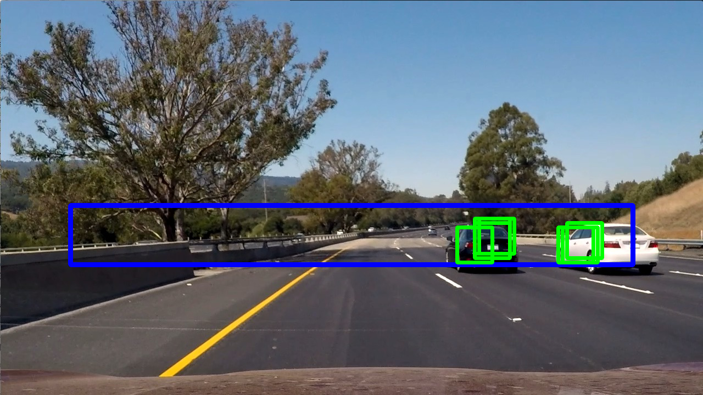

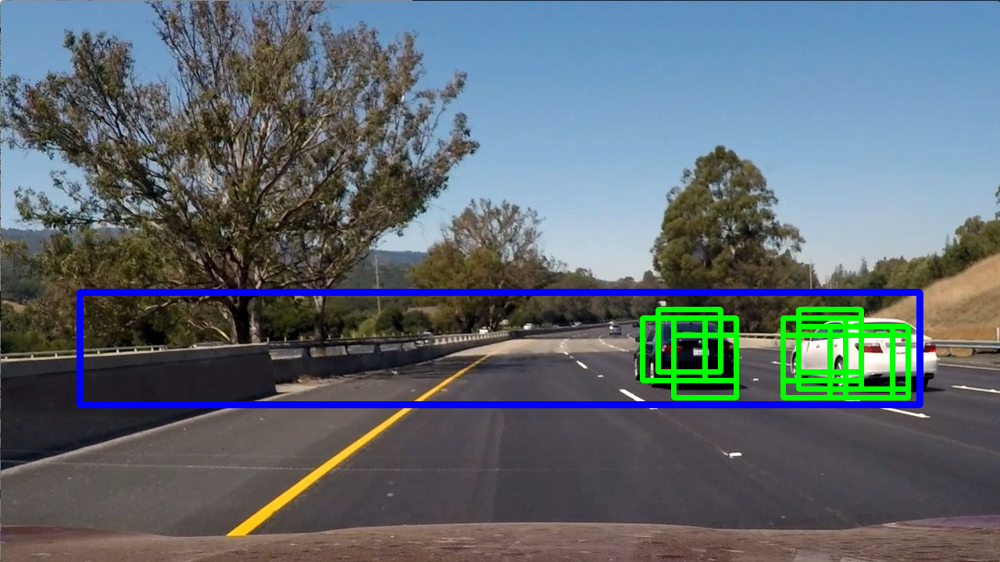

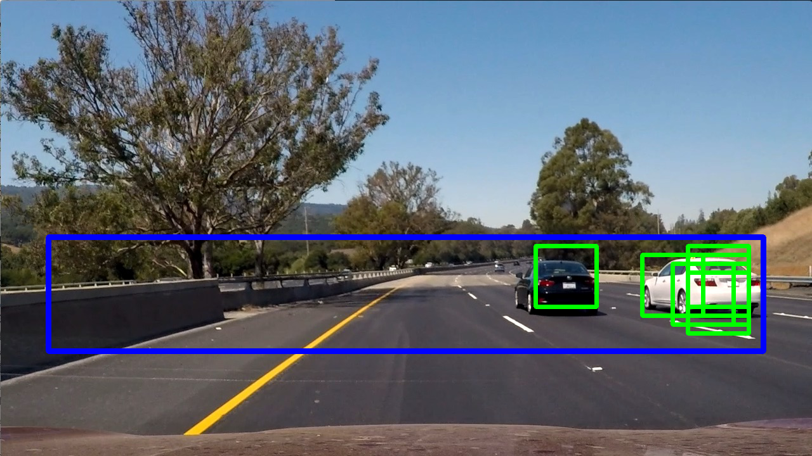

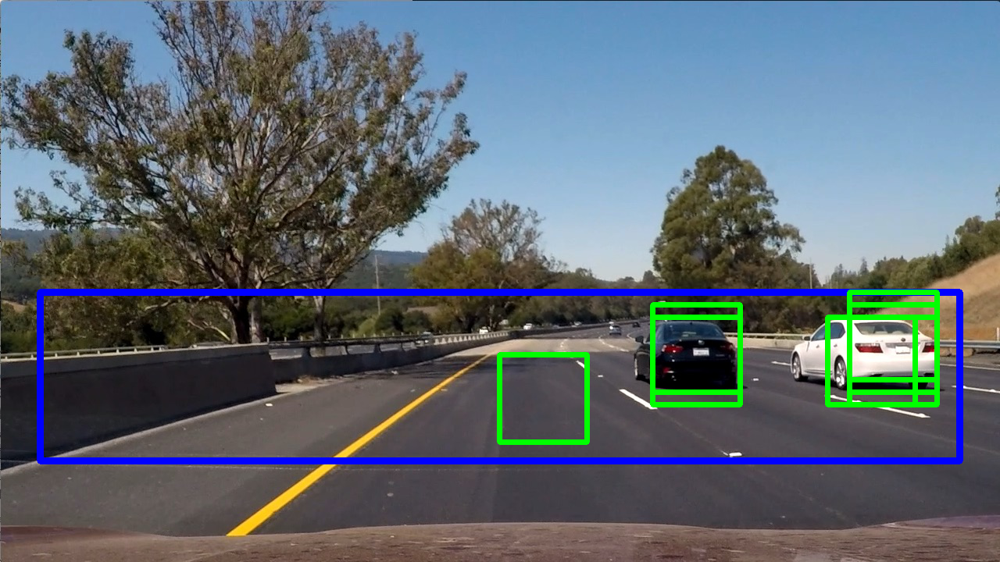

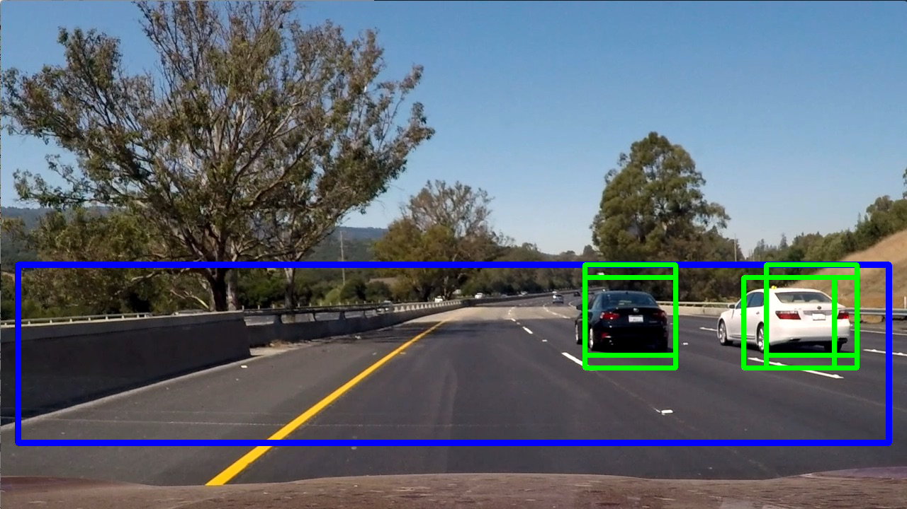

###2. Show some examples of test images to demonstrate how your pipeline is working.  What did you do to optimize the performance of your classifier?

Here are the detection results on the six test images:

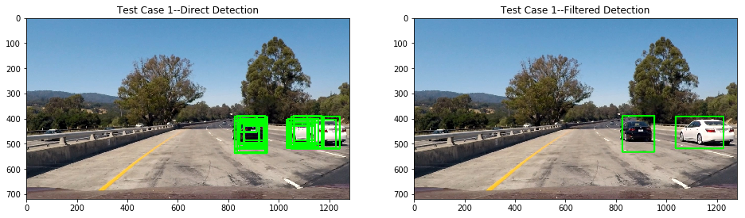

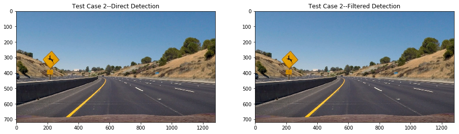

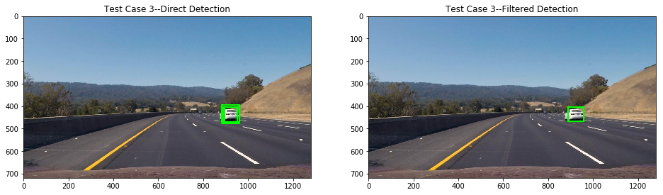

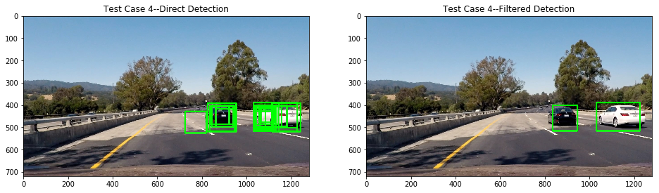

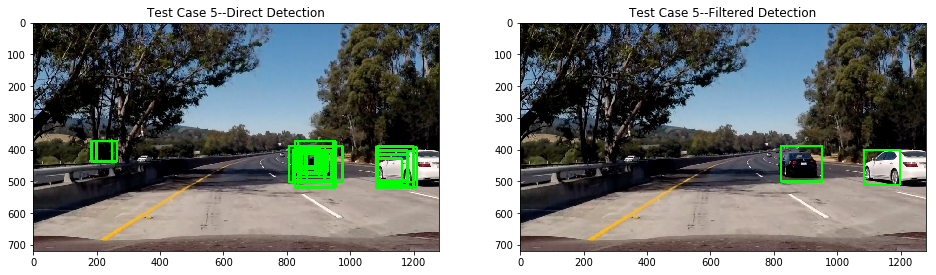

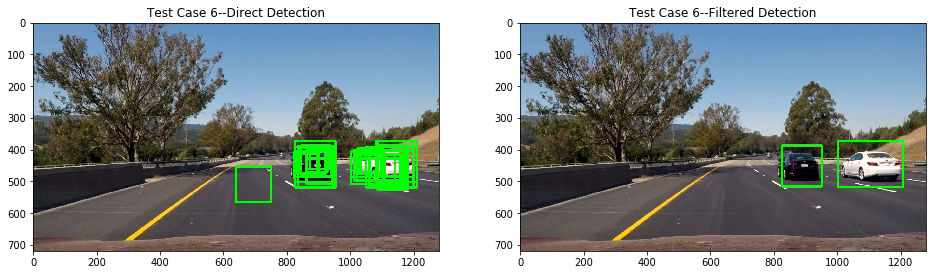

I use the following methods to improve the performance of my classifier:

1. The hyper-paramters of linear SVM are determined through grid search with cross validation;

2. After the best parameters are selected, the model is calibrated using 3-fold CalibratedClassifierCV;

3. For each detected region, only the one with confidence(attained through predict_proba of calibrated linear SVM) above the given threshold is used for heatmap accumulation.  

##Video Implementation

###1. Provide a link to your final video output.  Your pipeline should perform reasonably well on the entire project video (somewhat wobbly or unstable bounding boxes are ok as long as you are identifying the vehicles most of the time with minimal false positives.)
Here's the link to project video:

[Vehicle Detection on Videos](output_videos)

###2. Describe how (and identify where in your code) you implemented some kind of filter for false positives and some method for combining overlapping bounding boxes.

I recorded the positions of positive detections in each frame of the video. The heatmap filtering method provided in video tutorial is used to suppress false-positive detections. Both spatial and temporal filterings are applied:

1. For spatial filtering, inside each frame regions with accumulated detections below a given threshold are filtered.

2. For temporal filtering, consecutive spatially filtered bounding boxes within a given sliding window are heatmap filtered again to further improve detection quality.

The code snippet for spatial filtering is as follows:

```python
def process_image(image):
    # Detect:
    bounding_boxes = detector.detect(
        image
    )

    # Heatmap filtering:
    bounding_boxes = heatmap_filtering(image, bounding_boxes, heat_thresh)

    # Draw:
    canvas = image.copy()
    for bounding_box in bounding_boxes:
        (top, bottom, left, right) = bounding_box
        cv2.rectangle(
            canvas,
            (left, top), (right, bottom),
            (0, 255, 0),
            6
        )
```

The code snippet for temporal filtering is as follows:

```python
# Static variable decorator:
def static_vars(**kwargs):
    def decorate(func):
        for k in kwargs:
            setattr(func, k, kwargs[k])
        return func
    return decorate

# Frame processor:
@static_vars(
    TEMPORAL_FILTER_LEN=conf.spatial_filtering_filter_len,
    bounding_boxes_queue=deque(),
    heatmap_accumulator = np.zeros(
        tuple(conf.spatial_filtering_frame_size),
        dtype=np.int
    )
)
def process_frame(frame):
    """ Detect vehicles in given frame
    """
    # Format:
    frame = cv2.cvtColor(frame, cv2.COLOR_RGB2BGR)

    # Detect:
    bounding_boxes_current = detector.detect(frame)

    # Spatial filtering:
    bounding_boxes_current = heatmap_filtering(
        frame,
        bounding_boxes_current,
        conf.heat_thresh
    )

    # Temporal filtering:
    if len(process_frame.bounding_boxes_queue) == process_frame.TEMPORAL_FILTER_LEN:
        # Remove left one:
        for bounding_box in process_frame.bounding_boxes_queue.popleft():
            (top, bottom, left, right) = bounding_box
            process_frame.heatmap_accumulator[top:bottom, left:right] -= 1

    # Append:
    process_frame.bounding_boxes_queue.append(bounding_boxes_current)

    # Aggregate heat:
    for bounding_box in bounding_boxes_current:
        (top, bottom, left, right) = bounding_box
        process_frame.heatmap_accumulator[top:bottom, left:right] += 1

    # Filter:
    heatmap = process_frame.heatmap_accumulator.copy()
    heat_thresh = int(0.8 * len(process_frame.bounding_boxes_queue))
    heatmap[heatmap <= heat_thresh] = 0

    # Label it:
    labelled, num_components = label(heatmap)

    # Identify external bounding boxes:
    bounding_boxes_filtered = []
    for component_id in range(1, num_components + 1):
        # Find pixels with each car_number label value
        nonzero = (labelled == component_id).nonzero()
        # Identify x and y values of those pixels
        nonzero_y, nonzero_x = np.array(nonzero[0]), np.array(nonzero[1])
        # Define a bounding box based on min/max x and y
        bounding_boxes_filtered.append(
            (
                np.min(nonzero_y),
                np.max(nonzero_y),
                np.min(nonzero_x),
                np.max(nonzero_x)
            )
        )

    # Draw:
    for bounding_box in bounding_boxes_filtered:
        (top, bottom, left, right) = bounding_box
        cv2.rectangle(
            frame,
            (left, top), (right, bottom),
            (0, 255, 0),
            6
        )

    return cv2.resize(
        cv2.cvtColor(frame, cv2.COLOR_BGR2RGB),
        (960, 540)
    )    
```

Here's an example result showing the heatmap and the bounding boxes from a series of frames of video:


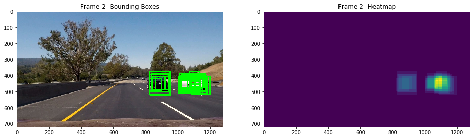


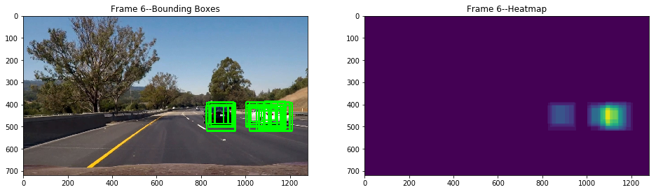

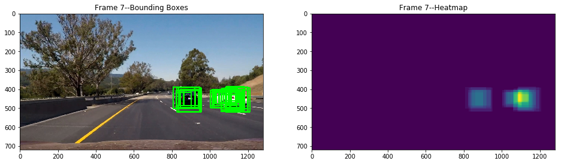

This is the final result after spatial temporal filtering:

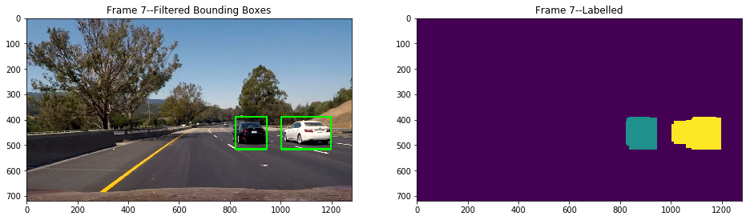

##Discussion

###1. Briefly discuss any problems / issues you faced in your implementation of this project.  Where will your pipeline likely fail?  What could you do to make it more robust?

Here are the problems identified during my iterative training-evaluation process:

1. Firstly, the parameters of sliding window pyramid detector are set through trial-and-error using heuristics.
They are not optimized together with vehicle detector.
2. What's more, there is a discrepancy between training dataset and testing video series. The contextual information is not used and detector could not make a stable detection on the boundaries of the vehicle. Windows partially overlapped with target vehicles should be added to training dataset so as to produce a more robust detector. Detection pipeline using MMOD method from Dlib could be used as a good starting point.
3. The pipeline is too slow. Modern method without exhaustive region proposal like YOLO nets could be used as foundation for real-time detection pipeline.
